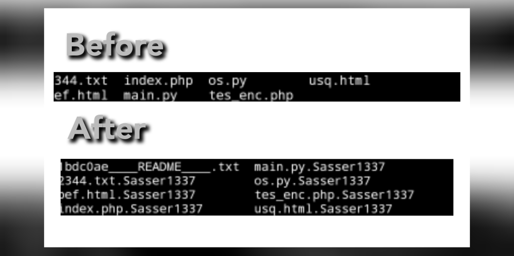

<h2 align="center">PHP File Encryption Script</h2>

<p align="center">
    <a href="https://github.com/Sasser1337/PHP-File-Encryption--Script/stargazers">
        
    </a>
    <a href="https://github.com/Sasser1337/awesome-github-profile-readme/network/members">
        
    </a>
    <a href="https://github.com/Sasser1337/PHP-File-Encryption--Script/blob/master/LICENSE">
        
    </a>
</p>
<p align="center">
    <a href="https://hits.seeyoufarm.com">
        
    </a>
</p>

<i> Encrypting Files and Folders with PHP Using AES-256-CBC: This script allows you to encrypt all files on your website with high-level AES-256-CBC encryption. <i>

<h2> How to use this </h2>

- Rename the file `indexs_example.phps` With `index.php`

- Upload the file to the victim's site

- After you upload it to the site, all files on the site will become example.txt example.txt.Sasser1337

- You need to change the message for the file 

```bash
1bdc0ae____README____.txt
```

- Change the message in the section code

```python
file_put_contents("1bdc0ae____README____.txt", "Congratulations, all files on your site have been encrypted by Sasser1337");
```
- It is possible that this code can create a Ransomware Attack :smile:

- See image below

 </img>

## How the Code Works

1. **encrypt_files_and_folders($path)**: This is a function used to recursively encrypt files and folders within a directory. It takes an argument `$path`, which is the directory path to be encrypted.

   - First, it retrieves all files and directories within `$path` using `glob()`.
   - Then, it loops through each item.
   - If it's a directory, the function is recursively called to encrypt its contents.
   - If it's a file and not `README.txt`, the `encrypt_file()` function is called to encrypt the file.

2. **encrypt_file($file_name)**: This function is used to encrypt an individual file. It takes an argument `$file_name`, which is the name of the file to be encrypted.

   - First, it generates a random encryption key and IV (Initialization Vector) using `openssl_random_pseudo_bytes()`.
   - Then, it encrypts the file's contents using the encryption key and IV using AES-256-CBC.
   - The encrypted result is stored in a new file with the extension `.Sasser1337`.
   - Optionally, the original (unencrypted) file can be deleted using `unlink()`.

3. **Main Process**: The main code starts by getting all files and directories in the current working directory (the directory where this PHP script is located).

   - For each item (file or directory), it checks whether it's a directory or a file.
   - If it's a directory, the `encrypt_files_and_folders()` function is called to encrypt all of its contents.
   - If it's a file and not `README.txt`, the `encrypt_file()` function is called to encrypt the file.

4. **Modifying or Creating README.txt**: Finally, after encrypting all files and folders, the code creates or modifies the `README.txt` file with a predefined message.

   - This file contains a message stating that all files on the site have been encrypted by "Sasser1337" and cannot be recovered.

## File Naming
The name used to save the encrypted files is the original file name with the `.Sasser1337` extension appended to it. So, if the original file is named `example.txt`, the encrypted file will be saved as `example.txt.Sasser1337`.

